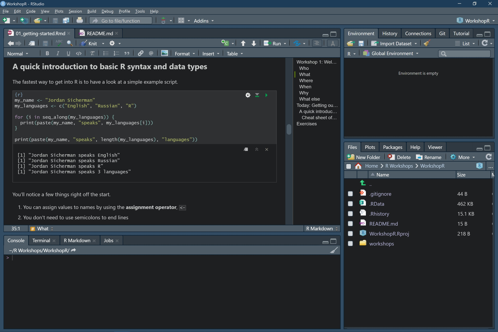

```{r setup, include=FALSE}
knitr::opts_chunk$set(echo = TRUE)
```

Thanks for tuning into the first installment of my R workshops! These weekly meetings will aim to teach the fundamentals of R through examples and applications. No prior experience in R (or any programming language, for that matter) is expected.

# Introduction

## Who

Jordan Sicherman, MSc. candidate in bioinformatics under the supervision of Dr. Paul Pavlidis (MSL).

## What

Weekly workshops to learn the fundamentals of R needed to load, manipulate, and visualize your data. Exact focus will depend on group interests, but a proposed syllabus is as follows:

**Week 1:** Introduction to R and RStudio, learning the basic syntax, data types and tools-of-the-trade \
**Week 2:** Data loading, cleaning and pre-processing\
**Week 3:** Coding in a pipeline\
**Week 4:** Conditional programming and loops\
**Week 5:** Writing your own functions and packages\
**Week 6:** Data science workshop\
**Week 7:** Making beautiful visualizations using {ggplot2}

Note that this order will not necessarily correspond with the numbers in the worksheets, depending on the course offering.

## Where

Zoom (join link [here](https://ubc.zoom.us/j/68356138185)).

## When

Fridays from 1:00 - 2:00 PST.

## Why

By the end of these workshops, you will gain the skills required to perform most basic data analysis in R, author (good) packages, benchmark/optimize your code and effectively self-learn future material.

Why should you choose R instead of other programming languages? R is known to be somewhat quirky (see R Inferno) and is not always the fastest language out there. Nonetheless, it has a large community of data analysts and statisticians, a huge selection of packages for easing your own analysis, and is easy to learn! It also has some of the best plotting libraries available.

## What else

I strongly recommend checking out these resources to supplement your learnings in R.

[Advanced R](https://adv-r.hadley.nz/) by Hadley Wickham, which provides (in my opinion) the best and simplest explanations to the many intricacies of R.

[R for Data Science](https://r4ds.had.co.nz/) by Hadley Wickham and others, which provides a similarly excellent overview of using R for problems in data science.

## How to get the most out of these workshops

You learn how to code by writing code. Don't just stare at the screen and watch me write solutions, get involved! Keep your Zoom on one side of the screen and your RStudio on the other side, making sure to write out code with me and comment it in areas where you're unsure of things.

# Today: Getting our bearings

## Outline

-   We'll first cover how to get started writing and running R code

-   We'll take a first look at the basic syntax and data types that provide a foundation for all of our future work in R

::: {.code}
1.  Download R from [CRAN](https://cran.r-project.org/)
2.  Download [RStudio](https://rstudio.com/products/rstudio/download/preview/)
:::

## Setting up your R working environment

We'll be focusing on running code in RStudio for these workshops. I'm using *v1.4.953-2 (preview)* which can be downloaded from [here](https://rstudio.com/products/rstudio/download/preview/). I strongly recommend this version as it introduces a visual markdown editor which makes it easy to see these notes while you write your scripts. You'll also need to download R, which is available on CRAN ([here](https://cran.r-project.org/)).

[{width="640"}](https://rstudio.com/products/rstudio/download/preview/)

Of course, there are many ways to run R code including via. a Jupyter notebook, or directly from the command line (via. the command `R`). If you have a CWL, you can use the Jupyter instance that Compute Canada provides at [syzygy](https://ubc.syzygy.ca/).

::: {.code}
If you don't want to download R, you can also use an online service provided by Compute Canada, accessible at [ubc.syzygy.ca](https://ubc.syzygy.ca/).
:::

When you're writing code, most work will be done in an R markdown file (.Rmd) or an R script (.R), but it's easy and fast to test things in the console, which can be navigated as you'd expect (up/down arrows). We'll spend some time getting familiar with RStudio to maximize your efficiency while minimizing your overhead. At the end of the day, your choice of IDE, layout, keybinds and etc. are your personal preference, but I'll show you what works for me and maybe it'll work for you too!

I make these notebooks available in a GitHub, available [here](https://github.com/jsicherman/WorkshopR). I will write these and update the repository as the weeks progress and I highly recommend you clone the repository to your R setup. This can be accomplished by cloning the repository once (`git clone https://github.com/jsicherman/WorkshopR.git`) and then updating it before each week's workshop by running `git pull`. They'll be uploaded as HTML files with embedded R Markdown so you can download and play around with the scripts inside.

::: {.code}
Clone the [GitHub repository](https://github.com/jsicherman/WorkshopR) for these workshops and make sure to keep your local copy up-to-date!
:::

## A quick introduction to basic R syntax and data types

The fastest way to get into R is to have a look at a simple example script.

```{r}
my_name <- "Jordan Sicherman"
my_languages <- c("English", "R")
my_n_languages <- 2

print(paste("Your first language is", my_languages[1]))

is_multilingual <- my_n_languages > 1

if (is_multilingual) {
  print("You are multilingual!")
}
```

You'll notice a few things right off the start.

1.  You can assign values to names by using the **assignment operator**, `<-`
2.  You don't need to use semicolons to end lines
3.  You use the function `c` to create **column vectors**
4.  R uses curly braces to enclose expressions.
5.  White space doesn't matter.
6.  You can subset vectors using square brackets (`[…]`)

Some other things are less obvious...

1.  Although `my_name` is only one element, it's also technically a vector (of length 1)
2.  R is 1-indexed, **not** 0-indexed. This means that the first element in a vector is at position 1, not position 0.

The way I learned how to code back in the day was by just downloading other peoples' scripts, changing entries and seeing what it does, so feel free to modify the code above to your heart's content.

We'll proceed quickly to see more common data types.

```{r}
# Create a data frame of data.
student_data <- data.frame(name = c("Jordan Sicherman", "John Doe", "Jane Doe"),
                           age = c(23, 31, 40),
                           favorite_language = c("R", "Python", "C++"),
                           knows_R = c(TRUE, FALSE, NA))

knitr::kable(student_data)

# Get the number of rows of our student_data
n_students <- nrow(student_data)

print(paste(student_data$name[1], 'knows_R is', student_data$knows_R[1]))

# Calculate the mean age of all the students
age_mean <- mean(student_data$age)
```

We'll talk at length about these data types as they will form the foundation of all our future work. We start by addressing a few lingering questions.

1.  How do we write comments in R code?
2.  What is a function? How do we call a function in R and pass the parameters we need?
3.  What does the `$` mean?
4.  What about `::`?
5.  How do I know what functions I need and how to use them?
6.  What can go wrong and how can I deal with it?

For these last questions, consider a scenario in which we want to sample `10` numbers at random from a normal distribution with a mean of `100` and standard deviation of `5` (ie. $N(\mu = 100, \sigma^2 = 5)$). At first glance, you may feel stuck before you even get started. Surely someone else has needed to do something like this in R, but how can *you* do it? Resist the urge to start panicking: the truth is that learners and experienced programmers alike lean on Google/Stack Overflow/etc. when they don't know function calls. Simply describe your problem in plain English and in 99% of cases, the first hit will be the function you need.

Once we find that `rnorm` is the appropriate function, we can try using it.

```{r, error=TRUE}
observations <- rnorm()
```

Alas, we run into an error when we try to run the code. R spits a scary looking error back to us. But what's `n`? How do we specify it? If you're ever in this position, R makes it easy to refer to the help documentation by simply putting a question mark before the name of the function we're confused about, like so:

```{r eval=FALSE}
?rnorm
```

From this, we can quickly read off the correct parameters and what each one means, allowing us to fix our previous attempt...

```{r}
observations <- rnorm(10, mean = 100, sd = 5)
```

### Cheat sheet: basic data types

**logicals**: `TRUE` and `FALSE` (can also be abbreviated as `T` and `F` and are interpreted as `1` or `0` in math contexts).

```{r}
something <- TRUE

if (something) {
  print("We did something!")
} else {
  print("We didn't do something :(")
}
```

**characters**: text or strings. Should be surrounded in double quotes (`"`) but can also be by single quotes (`'`).

```{r}
first_name <- "Jordan"
last_name <- "Sicherman"

print(paste("Your name is", first_name, last_name))
```

**factors**: a representation of a vector of characters, encoded as integral codes.

```{r}
planets <- factor(c("Mercury", "Venus", "Earth", "Mars", "Jupiter", "Saturn", "Uranus", "Neptune"))
planets
```

**numerics**: R automatically converts between `integers` and `doubles`. You don't have to worry about the difference too much. Mathematical operators are as you'd expect.

```{r}
secret_number <- sqrt(10^2.5 + 12.5 * (1 / pi))
```

**missing data**: R provides `NA` to stand in for data that is missing. This is different than `NULL`, which means that the value is undefined (not missing, although it may also technically be missing).

**vectors**: which again come in two "flavors": *homogeneous* (which include `atomic vectors`, `matrices` and `arrays`) and *heterogeneous* (`lists` and `data.frames`)

```{r}
odd_numbers <- c(1, 3, 5, 7, 9)
number_sequence <- 1:9

some_matrix <- matrix(number_sequence, nrow = 3, ncol = 3)
some_data_frame <- data.frame(some_identifier = LETTERS[1:10],
                              some_value = rnorm(10))

list_properties <- list(name = "Jordan",
                        favorite_number = 42,
                        knows_R = TRUE)
```

**closures and environments**: we'll get to these later

## Cheat sheet: basic syntax

| Description           | Symbol       | Example                                                         |
|-----------------------|--------------|-----------------------------------------------------------------|
| Add                   | `+`          | `2 + 2`                                                         |
| Subtract              | `-`          | `4 - 1`                                                         |
| Multiply              | `*`          | `4 * 2`                                                         |
| Power                 | `^`          | `2^8`                                                           |
| Divide                | `/`          | `5 / 3`                                                         |
| Modulus               | `%%`         | `6 %% 2`                                                        |
| Equality              | `==`         | `6 + 2 == 8`                                                    |
| Inequality            | `!=`         | `TRUE != FALSE`                                                 |
| Less than             | `<`          | `2 < 9`                                                         |
| Greater than          | `>`          | `9 > 2`                                                         |
| Less than or equal    | `<=`         | `pi <= 5`                                                       |
| Greater than or equal | `>=`         | `5 * 2 >= 2`                                                    |
| Short-circuiting AND  | `&&`         | `TRUE && FALSE`                                                 |
| Short-circuiting OR   | `||`         | `FALSE || TRUE`                                                 |
| Element-wise AND      | `&`          | `c(T, T, F, T) & c(T, F, F, T)`                                 |
| Element-wise OR       | `|`          | `c(T, F, F, T) | c(F, T, T, F)`                                 |
| Assignment            | `<-` or `->` | `something <- 10` or `10 -> something`                          |
| Vector indexing       | `[]` or `$`  | `c("A", "B", "C", "D")[1]` or `data.frame(A = 1:5, B = 6:10)$A` |
| List indexing         | `[[]]`       | `list(A = c(1, 2, 3), B = c(4, 5, 6))[[1]]]`                    |
| Checking help         | `?`          | `?sample`                                                       |

# Exercises

Identify the following standard data types by replacing `YOUR_ANSWER_HERE` with a length 1 character vector with the name of the correct data type.

```{r eval=FALSE}
# 31.05
ex1_A <- YOUR_ANSWER_HERE

# TRUE
ex1_B <- YOUR_ANSWER_HERE

# c(1, 3, 5, 7, 9)
ex1_C <- YOUR_ANSWER_HERE

# c(100, 31/50, "100%")
ex1_D <- YOUR_ANSWER_HERE

# data.frame(A = c("A", "B", "C"), B = c(TRUE, FALSE, FALSE))$B
ex1_E <- YOUR_ANSWER_HERE
```

Convert the following pseudo-code into valid R code

```{r eval=FALSE}
well_rounded_meal := [slice_of_pizza, taco, orange, apple, coffee]
list_of_calories := [392, 304, 71, 91, 1.8]

total_consumed_calories := sum of list_of_calories
total_foodstuffs_consumed := length of well_rounded_meal

print You consumed {total_foodstuffs_consumed} things for a total of {total_consumed_calories}
```
