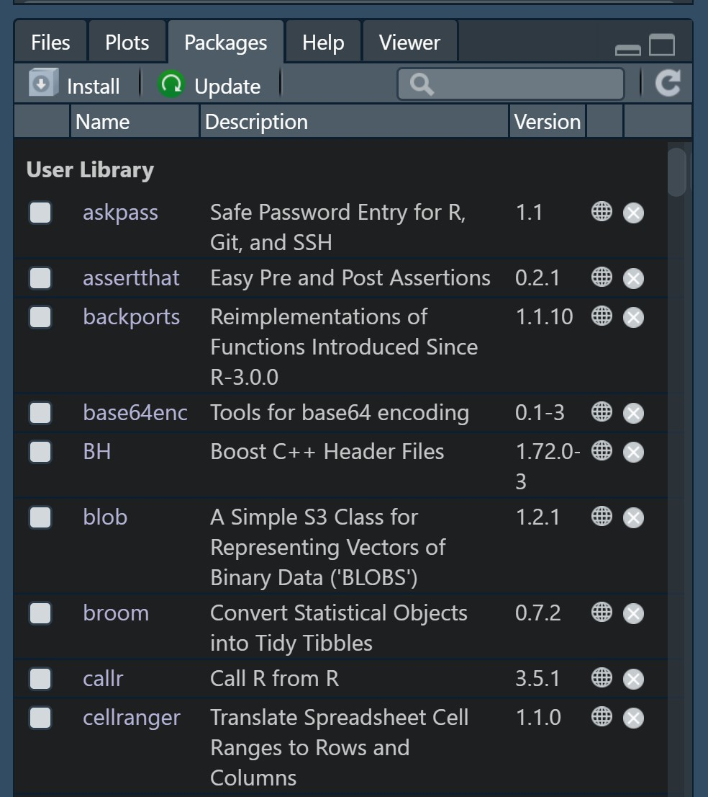
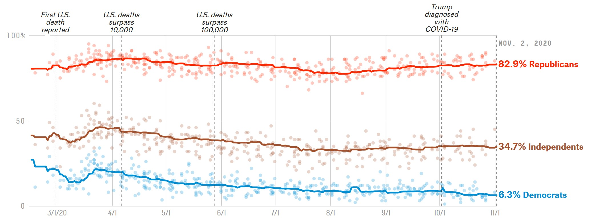

```{r setup, include=FALSE}
knitr::opts_chunk$set(echo = TRUE)
```

In [workshop 1](01_getting-started.html) we started our adventures in R by exploring our working environment and the various data types at our disposal. Today, we'll pick up where we left off by learning how to keep our environment and data clean and tidy. Now that you've had a chance to set up your R environment and learn the basics, we'll also transition to a lot more group working and a lot less of me talking at you.

# Introduction

## Learning Objectives

1.  Learn how to install and load packages
2.  Become fluent loading data from external sources
3.  Develop good practices for keeping your environment organized
4.  Learn some key functions needed to start pre-processing your data

# Today: Data Wrangling in R

## Outline

-   We'll first get familiar with how to extend base R functionality by installing and loading libraries

-   We'll then learn how to read .xlsx, .csv and .tsv, both local and remote using the {vroom} and {readxl} packages

-   We'll examine how R organizes our objects in the global environment and develop an intuition for how to keep ourselves organized

-   Finally, we'll dive into some basic data processing with {dplyr}

## Beyond base R

One of the strong sides of R is the abundance of high quality libraries that you can leverage to make your analysis faster and easier. Today, we'll start our session by installing three libraries that we'll lean on heavily.

Most R packages are hosted on a central repository known as CRAN. Package authors write R code and submit it there with documentation so that we can use it in whatever creative ways we want.

To install external packages from CRAN, it's as simple as running `install.packages` and waiting! Let's get started by installing {dplyr}, {vroom}, and {readxl}.

```{r eval=FALSE}
install.packages("dplyr")
install.packages("vroom")
install.packages("readxl")
```

::: {.code}
You can install CRAN packages by running `install.packages` and passing the name of the package. You only have to install packages once.
:::

Of course, there are also a great many packages on GitHub that haven't been added to CRAN that you still may want to use in your analyses. One library that makes it very easy to install these is called {devtools} (installed simply as `install.packages('devtools')`), which allows you to install from GitHub, Bioconductor or Bitbucket using the appropriate `devtools::install_*` function. One such package is [{Rphenograph}](https://github.com/JinmiaoChenLab/Rphenograph), which must be installed through GitHub. We probably won't use it in our workshops, but to give you a sense of how {devtools} works, you can install {Rphenograph} (but you don't need to) by running `devtools::install_github('JinmiaoChenLab/Rphenograph')`. The parameter you pass to the function is just the end of the GitHub URL (ie. <https://github.com/>**JinmiaoChenLab/Rphenograph**).

Once these are finished installing, the packages will be available for use on your local machine. You can check this out by navigating to the `Packages` panel in your RStudio instance.

{width="401"}

This is like installing an application on your phone. Just because these are *installed* doesn't mean they're *loaded*. You need to load the packages to use them using the `library` function, as follows:

```{r message=FALSE}
library(dplyr)
library(vroom)
library(readxl)
```

This is just like opening an application (although the metaphor breaks down slightly since you can have many loaded at once). You should typically load these libraries at the very top of your R scripts to stay organized and make sure they're accessible whenever you run the code.

::: {.code}
Load any required libraries at the top of your scripts using the `library` function.
:::

## Reading data

A common task in data analysis is loading your data into R in the first place. This functionality exists in base R (see the auto-complete options for `read.`), but implementations in {readr} and {vroom} are much faster.

{width="800"}

It's unfortunate that not all of these exist in one single package, but to summarize:

| Task                                      | Library  |
|-------------------------------------------|----------|
| Reading delimited (.csv, .tsv, etc) files | {vroom}  |
| Reading Excel files                       | {readxl} |

### Reading delimited data from local files

We'll demonstrate this with data from [FiveThirtyEight](https://fivethirtyeight.com/science/).

```{r}
covid_data <- vroom::vroom('data/covid-19-polls-master/covid_approval_polls_adjusted.csv')
```

It's good practice to check the `head` (the first few rows) of your loaded data to ensure it matches what you expect it to look like. You can also `glimpse` at it (some people prefer this view, and it's good for data with many columns) or simply peek at the `colnames` or `dim`.

```{r}
head(covid_data)
glimpse(covid_data)
colnames(covid_data)
dim(covid_data)

```

### Reading delimited data from remote sources

It is mostly unimportant whether your data is stored in your local filesystem or remotely; you can read the data using the same method calls. We'll see this using a .tsv file from the [Rivas Lab](https://github.com/rivas-lab/covid19) (prepared from [17th IHIW NGS HLA](http://17ihiw.org/17th-ihiw-ngs-hla-data/) data). Note that this file is a tab-delimited file rather than a comma-delimited one, but {vroom} auto-detects this for us and reads it appropriately. You can also specify this explicitly using the `delim` argument.

Furthermore, since the column names in the underlying data are not standard (like `#Locus` and `Ethnicity/Country`, we can assign more convenient names in one go).

```{r}
ihiw_data <- vroom::vroom('https://github.com/rivas-lab/covid19/raw/158f8c42387a6368dcb236d0f0d5c87561193966/HLA/17ihiw-Family-FQ.tsv',
                          col_names = c('locus', 'allele', 'ethnicity', 'frequency', 'allele_count', 'family_count', 'sample_count'))
```

### Reading Excel files

Excel files can be read into R using the {readxl} package. As the name suggests, it is only capable of *reading* Excel files (not writing them, although there are other packages for this).

We'll demonstrate this using some data that was collected for [this GitHub project](https://github.com/KaleidoscopeIM/Statistical-Profiling-Internet-Users) on profiling internet usage of different users. Note that since Excel files can have multiple sheets, we need to make sure we read the correct one (which can be accomplished by either browsing it in Excel, or using the `excel_sheets` function to output which sheets are present).

```{r}
readxl::excel_sheets('data/internet-users.xlsx')
internet_data <- readxl::read_excel('data/internet-users.xlsx')
```

### Reading R Data files

It's often convenient to save R objects to disk with all their proper structure so that you can read them in for later analysis. This is easily done using `saveRDS` and `readRDS`. Because this is very similar to the above, we won't spend time on this.

## Data wrangling in R

With data loading out of the way, it's time to get to the analysis.

It's often the case that the data that we load is not in the most convenient form to address our questions and so, we must get familiar with the main tools to work with our data. Remember before when we installed {dplyr}? Well now it's time to use it!

{dplyr} is a commonly used package that contains a ton of useful functions for data wrangling. Most typically, you'll use a few key functions:

| Function name | Purpose                                                                          |
|---------------|----------------------------------------------------------------------------------|
| mutate        | Adds or modifies column(s) to an existing data frame                             |
| summarize     | Creates a new data frame by summarizing all observations as specified            |
| group_by      | Group a data frame by certain column(s)                                          |
| filter        | Filter a data frame, only keeping rows where some expression evaluates to `TRUE` |
| arrange       | Sort the rows of a data frame according to some column                           |

We'll get a sense for how these work by doing some toy analysis on the data we loaded above.

### Mutations

Before getting started, make sure to read the help text for `mutate` (`?mutate`).

**Your task:** The data has columns for `approve` and `disapprove`: the percentage of respondents that either approve or disapprove of the `subject`. These do not necessarily sum to `100%` as respondents may have failed to respond or responded with something else. Create a column, `other` that contains the percentage of respondents who responded they neither `approve` or `disapprove`.

```{r}
# YOUR CODE HERE
```

::: {.spoiler}
```{r}
covid_data <- mutate(covid_data,
                     other = 100 - (approve + disapprove))
```
:::

It's very important to observe that `mutate` doesn't actually change the original data: it only gives you a **copy** that has been changed. If you want to keep the changes in R, you **must** make sure to re-assign it using the assignment operator, `<-`.

Like we mentioned before, `mutate` can also modify an existing column.

**Your task:** Take a look at the `grade` column in `covid_data`. You'll notice that appears to only contain a handful of unique entries. It often makes sense to store these discrete entries as factors instead of characters to ensure you don't accidentally insert something you're not supposed to. Use the function `as.factor` to convert the `grade` column to factor type.

```{r}
# YOUR CODE HERE
```

::: {.spoiler}
```{r}
covid_data <- mutate(covid_data,
                     grade = as.factor(grade))
```
:::

You can do several mutations in one go by simply listing everything you want to do as comma-separated entries.

**Your task:** We can see above that some data-looking columns aren't read as dates, but rather as characters, because their format isn't automatically detected. Date objects are convenient because they allow us to easily extract temporal information that we may care about.

There exists a built-in R function called `as.Date` which can convert characters into date objects, given a proper format (the relevant formatting is as follows: `%d` represents the date, `%m` the month and `%Y` the year). For example, `as.Date('13/01/2020', format = '%d/%m/%Y')` will be interpreted as `January 13, 2020`. Convert the four date columns that are stored as characters into their proper date representation.

```{r}
# YOUR CODE HERE
```

::: {.spoiler}
```{r}
covid_data <- mutate(covid_data,
                     modeldate = as.Date(modeldate, format = '%m/%d/%Y'),
                     startdate = as.Date(startdate, format = '%m/%d/%Y'),
                     enddate = as.Date(enddate, format = '%m/%d/%Y'))
```
:::

### Groups and Summaries

Groups behave somewhat unexpectedly (at least, to me) in {dplyr}: instead of changing the structure of the data itself, grouping information is stored in an *attribute* and the data itself looks exactly the same. Mutations, summaries, and other {dplyr} (*only* {dplyr}) functions typically respect these grouping variables, allowing you to do some powerful aggregations. To use the `group_by` function, simply specify a column name to group by and {dplyr} takes care of the rest.

**Your task:** Make a grouped version of `covid_data` by grouping based on the `pollster` column. Save this grouped data to `pollster_statistics`. Remember, the data structure will look the same, but you can confirm that it is now grouped by looking at the output of `print`.

```{r}
# YOUR CODE HERE
```

::: {.spoiler}
```{r message=FALSE}
pollster_statistics <- group_by(covid_data, pollster)
```
:::

Now that `pollster_statistics` is grouped, we can perform our operations on it as usual and expect that they will occur in grouped chunks. The benefit of this is that we can specifically query how the data in our data frame depends on the pollster.

**Your task:** We want to get an overview on whether the mean approval and disapproval rate vary by `pollster`. We already have a data frame that has been grouped by this variable, and can now compute a `summary`. Use the `summarize` function to calculate `mean_approve_adjusted` and `mean_disapprove_adjusted` for each pollster. Tip: use the `mean` function with `na.rm = TRUE` to calculate the mean, ignoring missing entries.

```{r}
# YOUR CODE HERE
```

::: {.spoiler}
```{r message=FALSE}
pollster_statistics <- summarize(pollster_statistics,
                                 mean_approval_adjusted = mean(approve_adjusted, na.rm = T),
                                 mean_disapprove_adjusted = mean(disapprove_adjusted, na.rm = T))
```
:::

### Filtering

We can emulate some of the analysis that **FiveThirtyEight** did by calculating the approval and disapproval rate by date and party, like the following (source: [FiveThirtyEight](https://projects.fivethirtyeight.com/coronavirus-polls)):

{width="800"}

**Your task:** Extract data from `covid_data` for only Democrats, Republicans and Independents, and save them in a data frame named `approval_data`. Once completed, run the code below to generate a figure similar to the one above. Tip: Remember to review the difference between `|` and `||`.

```{r}
# YOUR CODE HERE
```

::: {.spoiler}
```{r}
approval_data <- filter(covid_data, party == 'D' | party == 'R' | party == 'I')

# The following also work:
# approval_data <- filter(covid_data, party != 'all')
# approval_data <- filter(covid_data, party %in% c('D', 'I', 'R'))
```
:::

```{r eval=FALSE}
install.packages('ggplot2')
install.packages('reshape2')
```

```{r message=FALSE, warning=FALSE, eval=FALSE, fig.width=8, fig.height=3}
library(ggplot2)
library(reshape2)

approval_data %>%
  mutate(approve_adjusted = approve_adjusted / 100,
         party = recode(party,
                        I = 'Independents',
                        R = 'Republicans',
                        D = 'Democrats')) %>%
  ggplot(aes(startdate, approve_adjusted, color = party)) +
  geom_point(alpha = 0.2) +
  stat_smooth(aes(group = party), se = F,
              method = 'lm', formula = y ~ poly(x, 10)) +
  scale_color_manual(element_blank(),
                     values = c(Republicans = '#ff3915',
                                Democrats = '#008fd5',
                                Independents = '#a4522e')) +
  scale_y_continuous(labels = scales::percent) +
  scale_x_date(breaks = as.Date(paste0('2020-', 3:11, '-1')),
               labels = paste0(3:11, '/1')) +
  theme_classic() + xlab(element_blank()) + ylab(element_blank())
```
