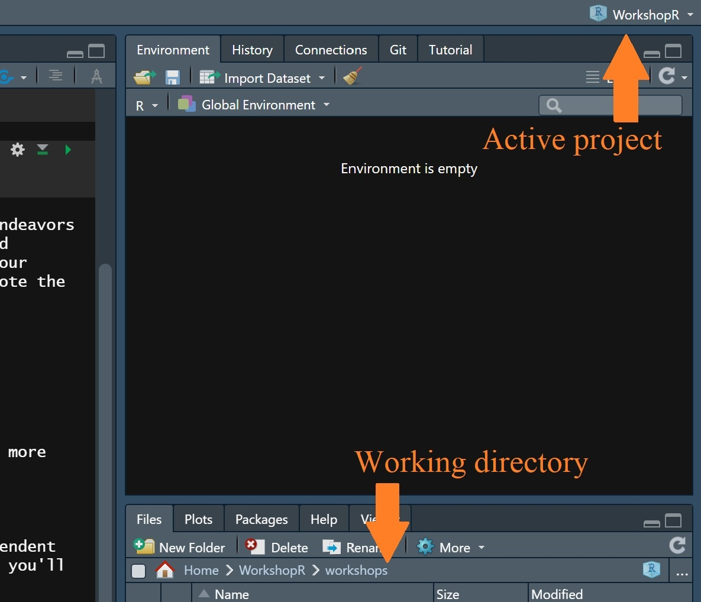
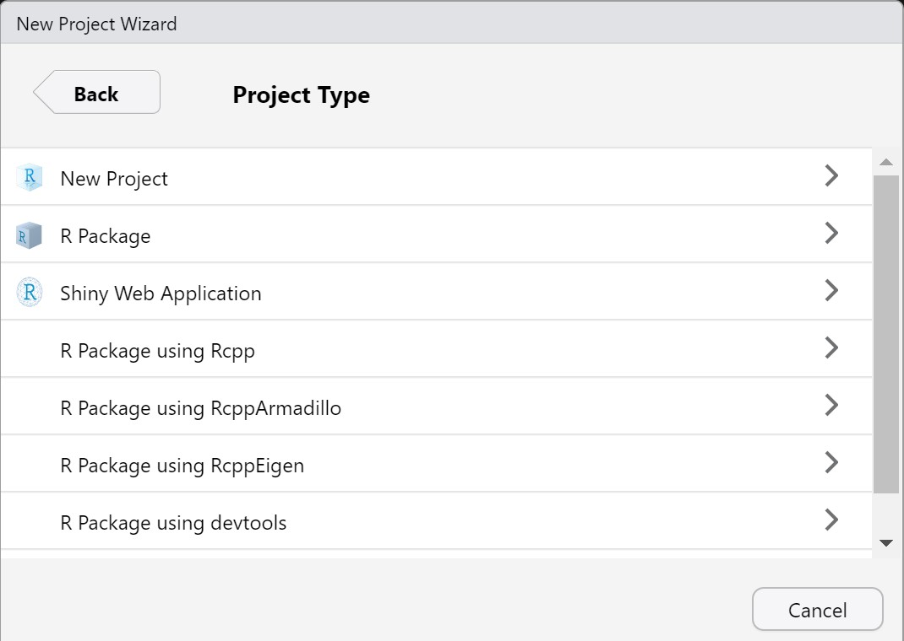

```{r setup, include=FALSE}
knitr::opts_chunk$set(echo = TRUE)
```

```{r message=FALSE}
library(dplyr)
```

We've now seen how to do a lot of basic data wrangling in R. These skills will be central to our future endeavors in R, but we need the ability to start modularizing our complex code so that we can effectively re-use and redistribute our work. Learning how to write nice functions and packages, as well as manage them, ensure our analyses are replicable and understandable for more than just the programmer at the specific time they wrote the code.

# Introduction

## Learning Objectives

1.  Learn how to set up projects in RStudio
2.  Build our first package, and learn the components that go into it
3.  We'll then shift our focus to writing functions themselves, the building blocks of packages and of our more complex kinds of analyses.

# R Projects

RStudio allows us to organize our different works into so-called projects. These projects should be independent and standalone to make the best use of this organization. If you look in the top-right corner of RStudio, you'll see projects that currently exist on your local machine.



A project defines two important things:

1.  Your working directory, which is the file path on your computer that R will consider as its home
2.  Your workspace, which is any data that is saved to disk between you starting and closing RStudio

You should get in the habit of creating R projects for new projects you're working on as it will ensure you stay organized with your analysis files and saved workspaces. You can create these projects by clicking on `File > New Project` in RStudio, which will open a dialog allowing you to create a new project, or clone one for you from GitHub. Generally, you'll be clicking the first option, invoking a menu like so:



For "simple" projects, you'll typically choose the first option ("New Project"). If you plan to create a tool to release for others to use, you'll likely want to choose "R Package using devtools". We'll do both today.

# Standard R Project

Your run-of-the-mill R project will be composed of mostly `.R` files if you plan to mostly write code for analysis, or mostly `.Rmd` files if you plan to mostly write code for teaching, presenting, or extensive documentation. If you're used to writing code in JupyterLab, or anticipate working closely with others on the code, you may prefer the latter. For reference, all these workshops were created in `.Rmd` files.

**Your task:** Create an R project and open it (making sure to enable "Open in new session"). Create a new `.R` file, called `helloworld.R` and an `.Rmd` (R markdown) file called `helloworld.Rmd`.

## Markdown

We'll focus on bulking up the `.Rmd` file first, which is a markdown file. It can be a combination of markdown (ie. "pretty" blocks of images, headers, text, and etc.) and code. The easiest way to start editing these files is to switch into the Visual Editor by clicking on the little compass icon in the top right, giving you access to the styling tools.

**Your task:** In `helloworld.Rmd`, switch to the Visual Editor and insert a title as a `Heading 1`, a description as a normal text block, and a code block that loads the library {dplyr}.

Hopefully you see that markdown is relatively straightforward to work with in the Visual Editor. When it comes to actually writing and running code, there are a few things to remember.

1.  The code still gets executed from top-to-bottom
2.  Data still gets saved to the global environment, so separate blocks of code can still communicate (again, remembering that things are defined from top-to-bottom. Feel free to separate your code logic into smaller, comprehensible chunks interspersed with text describing your goals, questions or thoughts at the time.
3.  Instead of being sent to RStudio's "Plots" output, graphical output is displayed directly inside the markdown document next to the code chunk that generated it

You should be in the habit of including your libraries you use at the top of the markdown document so they're accessible in the entire thing.

Finally, when you want to turn your markdown document into something for sharing (typically a PDF document or a website, `.html`), all you need to do is "Knit" it by clicking on the `Knit` icon at the top, which will save a snapshot of what your file looked like at the time of knitting. Doing this will re-run all your code in a clean environment to ensure that your results are exactly what your code specifies.

**Your task:** Knit your `helloworld.Rmd` file to a PDF (this will require some additional packages the first time you do it, which R will install automatically).

In theory, you could write [entire journal articles](https://github.com/rstudio/rticles) inside of RStudio. There exist add-ons for R Markdown for these and other purposes. If you want to see more, you can visit [this site](https://rmarkdown.rstudio.com/).

# R Package

R packages, in contrast to just projects, are collections of general purpose meant for sharing. We've already been working with these: {dplyr}, {reshape2}, {vroom}... All of these things we install to extend base R begin with someone writing a package.

{devtools} is a separate package that makes creating packages easier for developers. We previously used it to install packages from GitHub (`devtools::install_github(…)`), but we'll now use it to create packages.

**Your task:** Create another R project, but this time ensure you initialize it as an "R package with devtools". You can close the other project we created at this point, and make sure to open this new one in a new session.

If you inspect the working directory of this new project, you'll see that R has automatically created some files for us. Take a peek at it, and then look at this [cheat sheet](https://rawgit.com/rstudio/cheatsheets/master/package-development.pdf).

## General R package workflow

1.  Create the package skeleton (automatically done by selecting R package with devtools)
2.  Set up your project by editing `DESCRIPTION` and adding dependencies
3.  Write code with documentation
4.  Write tests for your code
5.  Repeat 3-4 until happy
6.  Automatically create documentation, build your package, and share it!

## Implementation time!

### General setup

**Your task:** First things first, you should do general project setup by editing your `DESCRIPTION` file. Insert your authoring name, a basic title and description, and any other entries you desire to change.

We also need to tell R which packages our users will need to run our code. For example, if we use functions from {dplyr} when writing our code, it's necessary for others to also install {dplyr} to use our code. We notify R of this using `usethis::use_package` and specifying the name of the package we need.

**Your task:** Tell R that your project requires {dplyr}. After doing this, check the `DESCRIPTION` file and see what has changed.

By doing this, we **do not** need to call `library(dplyr)` in our package itself. In fact, we **should not**. When the user loads our package, R will automatically load all the libraries we've specified that we depend on.

### Write and test code

Once general setup is done, we're ready to start writing code. We'll be flipping back and forth between this file and ["maps and more"](05_maps_and_more.html) to learn how to write functions for our package. For our R package, all code belongs inside the `R/` folder that RStudio created for us as `.R` scripts, so:

**Your task:** Create a file, `example.R` inside the `R/` directory, then open the link above to start learning how to write functions.

Note that when we're iterating on our code in a package, it's encouraged to write code, load it by calling `devtools::load_all()`, and then test it using `testthat` (`usethis::use_testthat`) or by writing code in the console. This is somewhat different than the process of iterating on our code in normal scenarios since we don't want to really keep any of our analysis, we just want to test it to make sure our general-purpose code works as intended.

### Create documentation

Once we have our functions written and commented, it's straightforward to generate the nice help files we've seen from other packages. We simply call `devtools::document()` to generate all the necessary files.

### Build our package

Building our package (`devtools::build()`, which requires [Rtools](https://cran.r-project.org/bin/windows/Rtools/) to be downloaded) creates a bundle of our package that can be installed and redistributed, and then installed using `devtools::install()`. At that point, you can use it like any other package!
