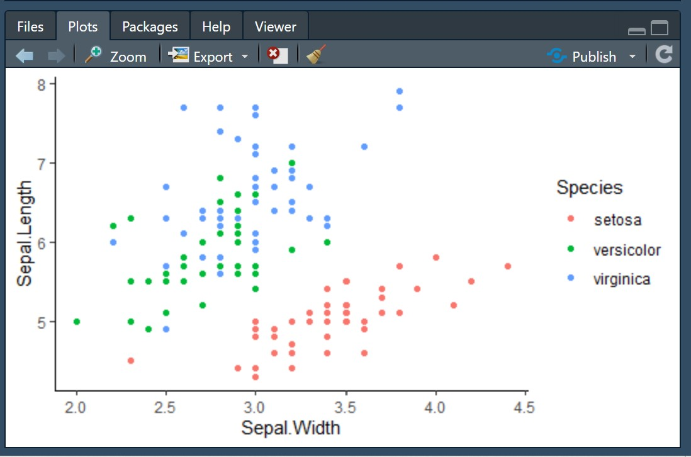

```{r setup, include=FALSE}
knitr::opts_chunk$set(echo = TRUE)
```

```{r message=FALSE}
library(dplyr)
library(ggplot2)
```

I got a little ahead of myself last time and said we finished all the core R material. In fact, there's one last thing remaining to master and that is {ggplot2} for plotting in R.

# Introduction

## Learning Objectives

1.  Learn how to create visualizations using {ggplot2}

# Plotting in R

While R is a great platform for data analysis in general, one area in which it really shines is in creating visualizations. This is enabled through a very powerful graphics library called {ggplot2}. As before, there exists a great cheat-sheet for {ggplot2} [here](https://github.com/rstudio/cheatsheets/blob/master/data-visualization-2.1.pdf).

If you have a keen eye, you might observe that plots in many publications are built in {ggplot2}: this is no coincidence. It's over 10 years old with hundreds of thousands of users and comprehensive documentation. As such, there are also countless online and print tutorials on it (see [links from the tidyverse](https://ggplot2.tidyverse.org/)) if you still want more after this worksheet.

## Examining Output

By default, R sends all plotting output to the current chunk (in .Rmd files) or the Plots tab in the bottom right corner of RStudio (when run from the console or in a .R file).

{width="498"}

You can pop the plot into a full screen tab by clicking on the `Zoom` button in that display. You can also save your plots to disk from that window by clicking on `Export` and selecting the options you'd like to use.

## Generating Output

Plotting is achieved (in large part) by use of {ggplot2}. To use this package, you have to install it and load it as usual:

```{r eval=FALSE}
install.packages('ggplot2') # Only run once
library(ggplot2) # Run whenever you want to use ggplot
```

Once installed and loaded, you're ready to generate plots!

The data that you'll plot will almost always in the form of a data frame with each observation you want to plot in one row. This is what we call "tidy data" as we saw before. It's thus important that we're able to wrangle our data into this kind of format using the various `melt`, `merge`, `dcast` and other data processing techniques we learned in the previous worksheets. Whenever you're getting ready to plot data, always ask yourself if every point you want to plot is on a row, and every feature you want to plot is on a column.

**Your task:** Base R provides a dataset called `trees` which contains data on 31 black cherry trees. Examine the data and consider a scenario where you want to plot the correspondence between `Girth` and `Height`: is the data tidy for this purpose? If not, use your data wrangling techniques to make it tidy. Remember to load the appropriate libraries if you need to.

```{r}
# TODO Your answer here
```

::: {.spoiler}
```{r eval=FALSE}
head(trees)
# The data is already tidy:
# 1. each row is an observation (tree)
# 2. each feature we want to plot (Girth, Height) is on a column
```
:::

**Your task:** The {tidyr} package contains information on the billboard top 100 for the year 2000 in `tidyr::billboard` where every number is a ranking for the corresponding `artist` and `track`. Examine the data there. Now consider a scenario where you want to plot a particular song's billboard rank over time: is the data tidy for this purpose? If not, use your data wrangling techniques to make it tidy. Remember to load the appropriate libraries if you need to.

```{r}
# TODO Your answer here
```

::: {.spoiler}
```{r eval=FALSE}
head(tidyr::billboard)
# The data is not tidy. We want to plot data over time, which implies that we want a column for "time". Instead, we have a column for each week, so we need to wrangle our data.
library(reshape2) # We'll use reshape2 to melt weeks into one column
melt(tidyr::billboard, id.vars = 1:3, variable.name = 'week')
```
:::

# {ggplot2}

With an understanding of what data can be plotted, we can proceed to actually learn the calls required to plot! To initialize a ggplot (the foundation of the plot), you will pass your data into the function `ggplot`.

```{r}
ggplot(iris)
```

By itself, this doesn't look like a whole lot. It only creates a plotting object with the specified data without associating any actual look-and-feel. In other words, it doesn't know what you want to plot. For this, you must specify so-called `aesthetics` via. the function `aes`.

## Aesthetics

Aesthetics are mappings that describe how the variables in the data are represented visually. You know this intuitively (ie. you know that a plot of `velocity vs. time` should take the form `y = velocity` and `x = time`), and the `aes` function offers a convenient way to construct this programmatically.

All you need to do is convert your plain-English instructions to code using key-value pairs. For the example above, if we wanted to plot `velocity vs. time`, we could construct an aesthetic mapping as `aes(x = time, y = velocity)`. Observe what this looks like in the print output:

```{r}
aes(x = time, y = velocity)
```

Other common aesthetics are available, as provided below.

| Key                 | Description         |
|---------------------|---------------------|
| `x` and `y`         | Coordinate mappings |
| `color` or `colour` | Stroke color        |
| `fill`              | Fill color          |
| `group`             | Grouping variable   |
| `size`              | Size                |
| `shape`             | Point shapes        |
| `alpha`             | Transparency        |

These aesthetics are passed to the underlying ggplot to instruct it how to construct our visualization as the second argument in the call to `ggplot`, as below:

```{r}
ggplot(iris, aes(x = Sepal.Length, y = Sepal.Width))
```

You can see now that {ggplot2} knows how to create the axes for our plot since we now specify the desired `x` and `y` variables, but there's still no data showing up. For that, you must add `geometry`.

## Geometry

Geometry represents the actual pixels that appear on your plots. It could be points (ie. a scatterplot), lines, bars, etc. or any combination thereof. As you'll see, this framework is highly flexible and offers precise control over your graphics.

Geometry is added by simply adding the call to the growing ggplot object. Continuing our simple example with the `iris` data, we see this by adding points with the `geom_point` function:

```{r}
ggplot(iris, aes(x = Sepal.Length, y = Sepal.Width)) + geom_point()
```

A list of common geometries is provided below.

| Function Call                                 | Purpose                               |
|-----------------------------------------------|---------------------------------------|
| `geom_point()`                                | Scatterpoints                         |
| `geom_line()`                                 | Lines                                 |
| `geom_bar()`                                  | Barplots                              |
| `geom_violin()`                               | Violin plots                          |
| `geom_jitter()`                               | Jitterplots                           |
| `geom_histogram()`                            | Histograms                            |
| `geom_density()`                              | Density plots                         |
| `geom_hline()` `geom_vline()` `geom_abline()` | Horizontal, vertical, and other lines |
| `geom_errorbar()`                             | Errorbars                             |

You're not limited to only one geometry: you can add as many as you want to any plot. Each new geometry stacks on top of each other in the order it was added. Compare the following:

```{r}
mtcars %>% ggplot(aes(mpg, hp)) + geom_point(color = 'red') + geom_line()
mtcars %>% ggplot(aes(mpg, hp)) + geom_line() + geom_point(color = 'red')
```

When we add the points after we add the line, they literally show up on top of the lines (or vice versa). You should also notice that each new geometry **inherits** the aesthetics from the underlying ggplot object.

**Your task:** Using the tidy version of the `tidyr::billboard`, plot a scatterplot of the billboard ranking vs. time for the song [Higher by Creed](https://www.youtube.com/watch?v=J16lInLZRms). *Hint: Use the code provided to convert the week column into a number before plotting to ensure the natural order is maintained.*

```{r}
# plotData <- TODO Your code here

# plotData <- plotData %>% mutate(week = as.integer(substring(week, 3)))
```

::: {.spoiler}
```{r eval=FALSE}
plotData <- melt(tidyr::billboard, id.vars = 1:3, variable.name = 'week') %>%
  filter(artist == 'Creed' & track == 'Higher') %>% mutate(week = as.integer(substring(week, 3)))

ggplot(plotData, aes(x = week, y = value)) + geom_point()
```
:::

## Constant Aesthetics

Sometimes, you don't want aesthetics to automatically adjust to variables in the data and instead you just want to make them constants for a given geometry. You saw this above when I made points red; can you guess how this is done?

Instead of passing the aesthetic inside of an `aes` call, simply pass it as a `key = value` pair in the geometry itself. For example, if you want to make all the points larger, you could specify the geometry as `geom_point(size = 5)`.

**Your task:** Create a scatterplot with a line for data from the `Theoph` dataset as `concentration vs. time`. Only plot data for doses of 4.00 mg/kg or 5.3 mg/kg. Make the points triangles (the shape for this is `2`) of size `3` and ensure both the lines and points are colored by the dose. *Hint 1: Make sure the dose is a factor before plotting to ensure it is plotted as a discrete variable. Hint 2: Ensure your data has a grouping variable to make the lines connect properly.*

```{r}
# TODO Your code here
```

::: {.spoiler}
```{r eval=FALSE}
Theoph %>% filter(Dose == 4 | Dose == 5.3) %>%
  mutate(Dose = as.factor(Dose)) %>%
  ggplot(aes(Time, conc, group = Dose, color = Dose)) +
  geom_point(size = 3, shape = 2) + geom_line()
```
:::

## Theme Elements

Besides the data look-and-feel, you may wish to specify different theme elements to make your plots feel just right. These include the appearance of the text, legend, plot area and labels.

The fastest and easiest way to make these more reasonable is to use pre-built themes. Like geometries, they can be stacked on top of your ggplot base using the `+`. One good one is `theme_classic()` but you may also prefer to install {cowplot} and use its theme or other pre-built themes too.

```{r}
mtcars %>% ggplot(aes(mpg, hp)) +
  geom_line() + geom_point(color = 'red') +
  theme_classic()
```

You also have find-grain control over different theme elements by using the `theme` function and manually specifying different properties. This is usually more complex and will often require some Googling. One common use case is changing text sizes for some of the different labels, which can be done using `element_text`.

```{r}
mtcars %>% ggplot(aes(mpg, hp)) +
  geom_line() + geom_point(color = 'red') +
  theme_classic() +
  theme(axis.text.x = element_text(angle = 45, hjust = 1)) # Rotate the x-axis labels by 45 degrees
```

You'll also usually want to tidy up your axis labels, which can be done by adding a `labs` command to your ggplot object. Note that you can also change legend labels this way by specifying the legend variable as the key.

```{r}
mtcars %>% ggplot(aes(mpg, hp)) +
  geom_line() + geom_point(color = 'red') +
  theme_classic() +
  theme(axis.text.x = element_text(angle = 45, hjust = 1)) +
  labs(x = 'Miles per Gallon (mpg)',
       y = 'Horsepower (hp)',
       title = 'Fuel Efficiency',
       subtitle = 'Based on cars from the 1974 Motor Trend magazine',
       tag = 'A')
```

## Faceting

Sometimes, one panel is not enough to sufficiently represent our data. For these cases, it's beneficial to create separate `facets` (subplots), which can be done through the `facet_wrap` function. To motivate this, consider the following jitterplot using data from [Tidy Tuesday](https://github.com/rfordatascience/tidytuesday/blob/master/data/2020/2020-07-07/readme.md).

```{r}
coffee <- vroom::vroom('https://raw.githubusercontent.com/rfordatascience/tidytuesday/master/data/2020/2020-07-07/coffee_ratings.csv')

coffee %>% filter(!is.na(color), color != 'None') %>%
  ggplot(aes(color, cupper_points, color = processing_method)) +
  geom_jitter() +
  theme_classic()
```

When plotted this way, points overlap and we can't make the distinction we'd like. One way we can make this more clear by making separate panels for each processing method. This is done by faceting on the `processing_method` variable, like so.

```{r}
coffee %>% filter(!is.na(color), color != 'None') %>%
  ggplot(aes(color, cupper_points, color = color)) +
  geom_jitter() +
  theme_bw() +
  facet_wrap(~processing_method) +
  theme(legend.position = 'none') # Hide the legend since we already have panels
```

To make it explicit, `facet_wrap` simply accepts a formula to determine how to do the faceting (in most cases, it's sufficient to just put a tilde followed by variable you want to facet on). You can also specify the number of rows or columns (`nrow` or `ncol`) you want to wrap into. Finally, if you have unequal scales, you can allow different panels to have different scales by specifying the `scales` argument, allowing the y-axis to be free (`free_y`), the x-axis (`free_y`), or both (`free`).

```{r}
coffee %>% filter(!is.na(color), color != 'None') %>%
  ggplot(aes(color, cupper_points, color = color)) +
  geom_jitter() +
  theme_bw() +
  facet_wrap(~processing_method, scales = 'free_y') +
  theme(legend.position = 'none')
```

**Your task:** Modify the above plot by adding a violin plot with a black outline below the jitter points. Also change the point sizes to be equal to the `numer_of_bags` sold for each bean, and the alpha to be `0.5`. Add a title and tag to the top-left corner of the plot. Clean up the labels for the x- and y-axis, and make the facets 3x2 instead of 2x3. Finally, increase the base font size to `20` (*Hint: ?theme_bw*).

```{r}
# TODO Your code here
```

::: {.spoiler}
```{r eval=FALSE}
coffee %>% filter(!is.na(color), color != 'None') %>%
  ggplot(aes(color, cupper_points)) +
  geom_violin() + # Must come before jitter to plot below it
  geom_jitter(aes(color = color, size = number_of_bags), alpha = 0.5) + # Constant alpha and geometry-specific size and color
  theme_bw(base_size = 20) +
  facet_wrap(~processing_method, scales = 'free_y', nrow = 3, ncol = 2) +
  theme(legend.position = 'none') +
  labs(x = 'Color', y = 'Cupper Points', title = 'Coffee Ratings by Processing Method', tag = 'A')
```
:::
