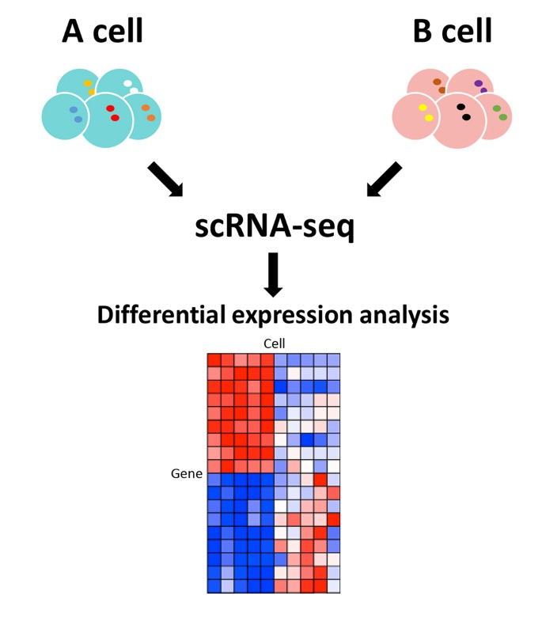

```{r setup, include=FALSE}
knitr::opts_chunk$set(echo = TRUE)
```

```{r message=FALSE}
library(dplyr)
```

# Introduction

Today we'll tackle a big topic: differential gene expression analysis (using {DESeq2}). This isn't a statistics or bioinformatics course, so I won't get too much into the nitty gritty details, but there will be plenty of links for further reading if you desire it. The goal is to give you the tools to run a (good!) DE analysis starting from processed counts.

## Learning Objectives

1.  Learn how to do differential expression analysis using DESeq2, including quality checking, multithreading and pre-filtering

# Differential expression analysis

Differential expression analysis is a statistical analysis to discover changes in gene expression levels between two groups. In brief, a researcher gathers mRNA from (at least) two groups (ie. "control group" and "disease group"), sequences it, aligns the sequences to a reference and then runs the analysis to see if there are significant differences in transcript abundance between the different groups.



There are many excellent packages in R for doing this kind of analysis, and your choice will typically be whatever one you're most comfortable with, or whatever one your lab happens to use most regularly. There are methodological differences between the different R packages (ie. you won't get the exact same results if you use different tools) and they may lead you to prefer different packages (ie. DESeq2 has been demonstrated to be somewhat overly sensitive compared to some other tools), but there is generally good agreement.

**Note:** we'll be reviewing methods for bulk gene expression data, not single cell (methods for single cell analysis usually assume different assumptions of the underlying distribution).

## Analytical workflow

Best practices in differential expression analysis (DEA) mandate four steps:

1.  Normalization
2.  Quality control
3.  Clustering
4.  DEA

### Normalization

The goal of normalization is to ensure that there is no difference in quantification due to variable sequencing depth and/or gene length, as these factors can potentially confound between-sample differences.

### Quality control

This essential step ensures our data is of sufficiently high quality (correctly labelled, free of batch effects, etc.). We may also want to subset for genes that we have enough sufficient statistical power to call differential expression, and remove those that look like outliers with extremely high counts, or 0 counts.

### Clustering

Clustering is a visualization technique which we can apply to identify sources of variation in our data, which helps us build our statistical model.

### Preparing our data

DESeq2 incorporates all of the above steps in just one simple command, making the analysis quick, easy and replicable. To get started, let's install DESeq2, which is available from Bioconductor.

```{r eval=FALSE}
# We need to install BiocManager to use download packages from Bioconductor
install.packages('BiocManager')
# Since DESeq2 is on Bioconductor instead of CRAN, install from BiocManager (this takes about 3 minutes)
BiocManager::install('DESeq2')
```

And, as always, remember to load it.

```{r message=FALSE}
library(DESeq2)
```

Note that the material I walk through below is from the vignette for DESeq2, [here](http://bioconductor.org/packages/devel/bioc/vignettes/DESeq2/inst/doc/DESeq2.html). For sake of brevity, I'll focus on the most important aspects, but there's plenty more you can do, which you can read about at the link above.

We'll load data from the web. There are two data files to load:

1.  Count data (the gene expression levels for each sample sequenced)
2.  Sample metadata (information about each sample)

**Your task:** Load the count data from the URL <https://www.ebi.ac.uk/gxa/experiments-content/E-GEOD-50760/resources/DifferentialSecondaryDataFiles.RnaSeq/raw-counts> and the metadata from the URL <https://www.ebi.ac.uk/gxa/experiments-content/E-GEOD-50760/resources/ExperimentDesignFile.RnaSeq/experiment-design>. Save these to the names `count_data` and `sample_meta`, respectively.

```{r}
# TODO Your code here
```

::: {.spoiler}
```{r eval=FALSE}
count_data <- vroom::vroom('https://www.ebi.ac.uk/gxa/experiments-content/E-GEOD-50760/resources/DifferentialSecondaryDataFiles.RnaSeq/raw-counts')
sample_meta <- vroom::vroom('https://www.ebi.ac.uk/gxa/experiments-content/E-GEOD-50760/resources/ExperimentDesignFile.RnaSeq/experiment-design')
```
:::

**Your task:** Have a look at `count_data`. You'll notice that the first two columns are gene symbols and official names, and that the rest of the columns are numeric. Those numeric columns are named with the sample name and contain gene expression data for the corresponding gene ID/name. Count data will always be in a format like this (genes `x` samples). To make it usable by {DESeq2}, we need to do a few things:

1.  Move the gene information out of the count matrix so that it only contains count data (ie. the numbers)
2.  Convert it from a `tibble` (which is essentially the same thing as a `data.frame`) to a matrix. Remember that matrices are homogeneous data structures in R (which is good since it will only contain numbers)

Save the vector of `Gene ID`s to the variable `gene_ids`. Then, use `select` to "deselect" the first two columns of `count_data` (make sure to save the result of this selection back to `count_data`). *Tip: you can "deselect" columns by passing the column indices you want to remove as negative numbers.* Once this is done, use `as.matrix` to convert the result to a matrix and use the function `rownames` to set the rownames of `count_data` to the `gene_ids` you saved.

```{r}
# TODO Your code here
```

::: {.spoiler}
```{r eval=FALSE}
gene_ids <- count_data$`Gene ID`

# Deselect the first two columns and make it a matrix
count_data <- count_data %>%
  select(-(1:2)) %>%
  as.matrix

# And now set the rownames
rownames(count_data) <- gene_ids
```
:::

**Your task:** We'll also clean up the `sample_meta` by first selecting only the columns `1, 2, 4, 6, 8, 10, 12` since they are the simple names (rather than URLs). Use `colnames` to set the column names to simple names (ie. lowercase, no spaces. For example, you may want to rename "Sample Characteristic[biopsy site]" to "biopsy_site").

```{r}
# TODO Your code here
```

::: {.spoiler}
```{r eval=FALSE}
sample_meta <- sample_meta %>%
  select(c(1, seq(2, 12, by = 2)))

colnames(sample_meta) <- c('run', 'biopsy_site', 'disease', 'disease_staging', 'individual', 'organism', 'organism_part')
```
:::

We should also perform a sanity check to make sure the samples' expression data (the columns in `count_data`) occur in the same order as their paired metadata (the rows in `sample_meta`), otherwise we may run into issues with mismatched metadata associations.

**Your task:** We can easily check this by comparing the `colnames` of `count_data` to the `run` column of `sample_meta`. Compare these for equality, and use the `all` function to see if all elements are equal.

```{r}
# TODO Your code here
```

::: {.spoiler}
```{r eval=FALSE}
all(colnames(count_data) == sample_meta$run)
```
:::

If you got `FALSE` above, it means that the elements are not in the exact same order, and we have to reorder them to match. The easiest (but not the most intuitive) way to do this is by selecting the columns of `count_data` in the order they appear in `sample_meta$run`.

**Your task:** Reorder the columns of `count_data` so that they're in the same order as they appear in `sample_meta`. To do this, you can first look at the order they appear in `sample_meta$run`, and then use this output to subset those columns from `count_data`. If this is confusing, consider the following example:

```{r}
example_count_data <- matrix(1:12, ncol = 4, dimnames = list(NULL, LETTERS[1:4]))

example_sample_meta <- data.frame(run = c('B', 'D', 'A', 'C'), disease = c('cancer', 'reference', 'reference', 'cancer'), stage = c('II', NA, NA, 'I'))

print(example_count_data)
print(example_sample_meta)

# The order of the columns (A, B, C, D) does not match the order of the metadata (B, D, A, C). We can select them in the proper order by simply telling R the column names we want in the right order:
example_count_data[, c('B', 'D', 'A', 'C')]

# Or equivalently, since this information is encoded inside of the meta:
example_count_data[, example_sample_meta$run]
```

Now it's your turn.

```{r}
# TODO Your code here
```

::: {.spoiler}
```{r eval=FALSE}
count_data <- count_data[, sample_meta$run]
```
:::

Compare the column names to the `run` again to ensure it now matches before moving forwards.

With that pre-processing out of the way, we're ready to construct a `DESeqDataSet`, a convenient package of count data and sample metadata that will allow us to easily perform our analyses. We can quickly do this using `DESeqDataSetFromMatrix`, passing it our `count_data` and `sample_meta`. {DESeq2} requires us to pass a `design` to our dataset. We'll cover this soon, for now, just pass `design = ~1`.

Save this dataset to `dataset`.

```{r}
# TODO Your code here
```

::: {.spoiler}
```{r eval=FALSE}
dataset <- DESeqDataSetFromMatrix(count_data, sample_meta, design = ~1)
```
:::

Now that we have our data packaged into this `dataset` object, we can remove our `sample_meta` and `count_data` objects to save on memory and keep our environment clean. Use `rm` to remove them.

### Preliminary analysis and QC

We'll now do some basic visualization to get a sense of where the variation in our data is coming from. {DESeq2}. We can inspect the metadata (via. `colData(dataset)`) and see that the columns `biopsy_site` and `individual` are the primary metadata columns, so we'll quickly look at a PCA plot of our expression data to see if the groups cluster like we'd expect.

Remember, we want to normalize the raw counts before doing any visualization.

**Your task:** We'll get a sense of the variance in our data in 3 easy steps.

1.  Normalize the counts using {DESeq2}'s function, `vst`, and save the output to `normalized_dataset`
2.  Use `plotPCA` to generate a PCA plot of the normalized counts. We'll actually generate two PCA plots to look at the different groups of interest to us. First, generate one using `biopsy_site` as the interesting group (`intgroup`) and a second one using `individual` as the interesting group. DESeq2 generates PCA plots based on the top 500 variable genes (by default).

```{r}
# TODO Your code here
```

::: {.spoiler}
```{r eval=FALSE}
normalized_dataset <- vst(dataset)

plotPCA(normalized_dataset, intgroup = 'biopsy_site')
plotPCA(normalized_dataset, intgroup = 'individual')
```
:::

By inspection, there is no obvious clustering by individual in PCs 1 or 2 (we might see this in future PCs though). We do see an interesting separation, however, in `biopsy_site` with most points clustering according to their group, but with one point from "normal" clustering with the "colorectal cancer" (and vice versa) which may indicate some labelling issue. If we were doing this analysis for real, we would want to follow up on this. If we had batch information, we would also like to inspect at this stage if there is any appreciable batch effect in our data.

Once we're satisfied with our sample-level QC, we can examine some gene-level QC. DESeq2 allows us to add library size factors and gene-wise dispersion estimates directly to our dataset object, which allows for more accurate identification of differentially expressed genes.

```{r eval=FALSE}
dataset <- dataset %>%
  estimateSizeFactors %>%
  estimateDispersions
```

We can plot the mean-dispersion relationship using {DESeq2}'s `plotDiseEsts` on this dataset. We want to make sure that the data generally scatters around the curve, with the dispersion decreasing with increasing mean expression levels. For your reference, the output of this data looks good. If it was a different shape (ie. bowl-like, very tight around the curve, etc.), you should check your data for signs of contamination.

### Differential expression analysis

Finally, we're ready to actually analyze our data. Note that {DESeq2} makes this very simple and performs all the workflow steps (normalization, some simple QC, etc.) for you. Other software packages (ie. limma, edgeR) may not do this, so it's important to read the vignette for whatever software package you're using and ensure you perform the necessary pre-processing steps before blindly throwing your data into it. But, since we're using DESeq2, and we're satisfied with our data quality, we can proceed to differential expression analysis.

First, we need to specify our statistical model. This model defines what measured sources of variability we want to "regress out", how they interact, and what our contrast of interest is. This is done by specifying a `formula` that defines our model.

You've seen formulae in R once before in the context of `dcast`. In general, they are of the form `response ~ predictors`. In differential expression analysis, our "response" is the gene count, and the "predictors" we specify are known sources of variation.

In this data, the contrast of interest (the one the experimenters were studying) is stored in `dataset$biopsy_site`. It has three unique values: "primary tumor", "normal", and "colorectal cancer metastatic in the liver". We generally want to compare everything to our baseline (ie. "normal"), and we tell DESeq2 this by making it the first `level` in the `factor`. All other variables we will use in our model should also be either factors or numerics. So, to proceed...

**Your task:** Convert `dataset$biopsy_site` to a `factor` where the first level is "normal". Also convert `dataset$individual` to a factor (levels don't matter).

```{r}
# TODO Your code here
```

::: {.spoiler}
```{r eval=FALSE}
dataset$biopsy_site <- factor(dataset$biopsy_site, levels = c('normal', 'colorectal cancer metastatic in the liver', 'primary tumor'))
dataset$individual <- as.factor(dataset$individual)
```
:::

Now we can construct our model. We know that the data itself (the counts) are what we're trying to model. So when designing our model (which is of the form `response ~ predictors`), we can simply omit the response, and {DESeq2} will interpret this just like we desire.

For the predictors, we should add the minimal set of sample metadata entries that we suspect are adding unwanted variation. Determining these is somewhat of an art and requires good knowledge of your data. You can get a sense of them by seeing if any variables in your sample metadata reveal any clustering patterns in PCA, but people tend to use things like `batch`, `sex`, `post-mortem interval (PMI)`, `brain region` and things like that where there is demonstrated (or highly suspected) differences that arise not due to the contrast of interest (usually the disease). In our case, we'll use `individual` as our sole covariate, as we suspect that samples from the same individual are likely more similar than samples from different individuals, and we don't want this source of variability to be interpreted as related to the cancer diagnosis (stored in `biopsy_site`).

When creating our model formula, our contrast of interest should be the last predictor, so {DESeq2} knows that it's the one we're testing. So in this case, our model should look like:

```{r}
~ individual + biopsy_site
```

We use plus signs to separate independent factors and each entry should be a column name in our metadata.

**Your task:** Imagine we had sample meta for `batch`, `PMI`, `sex`, `diagnosis`, `height`, and `weight`. Describe how you would choose which covariates to include in your model, and create a model formula that's ready for DEA.

```{r}
# TODO Your explanation and code here
```

::: {.spoiler}
```{r eval=FALSE}
# We could begin by assuming that batch, PMI, and sex are relevant covariates that should be included.
# We could then generate PCA plots to see if there is any undesired clustering by these variables in the top most highly variable genes
# If we decided on those covariates, our model would look like the following:
~ batch + PMI + sex + diagnosis

# Note that batch, PMI and sex can be in any order. diagnosis must be last, and it should be a factor with the first level as the baseline condition
```
:::

**Your task:** Add the appropriate model to our `dataset` by assigning it with the function `design`.

```{r}
# TODO Your code here
```

::: {.spoiler}
```{r eval=FALSE}
design(dataset) <- ~ individual + biopsy_site
```
:::

And finally, we're ready to run our differential expression analysis by calling `DESeq` on our `dataset`. This will perform all necessary filtering and normalization and run the differential expression analysis all in one go!

```{r eval=FALSE}
DE_results <- DESeq(dataset)
```

#### Multicore DEA

We can speed up our analysis by running it over multiple cores (computational units on our computer). To do this, we must install the appropriate package and tell it how many cores we wish to use.

```{r eval=FALSE}
# Run at the start of the file to load the library
library(BiocParallel)
# And register how many cores we want to use. Change the 4 to however many cores you want to use
register(MulticoreParam(4))

# And then do DEA with parallel enabled
DE_results <- DESeq(dataset, parallel = T)
```

## Examining results

{DESeq2} stores the output in a data frame that can be accessed by calling `results` on the output. Since our contrast of interest had three levels ("normal", "primary tumor" and "colorectal cancer metastatic in the liver"), we have to tell it which comparison we want results for. This is done by specifying a 3-element vector with the name of the factor, the contrasting value and the baseline value. For example, if we wanted to see the differential expression results for the primary tumor group compared to the normal group, we could run:

```{r eval=FALSE}
results(DE_results, contrast = c('biopsy_site', 'primary tumor', 'normal'))
```

We can omit the `contrast` when our contrast of interest only has two levels.

There is a lot of downstream analysis we can do with these results, but this workshop is already running long so I'll leave that to a later date :)
