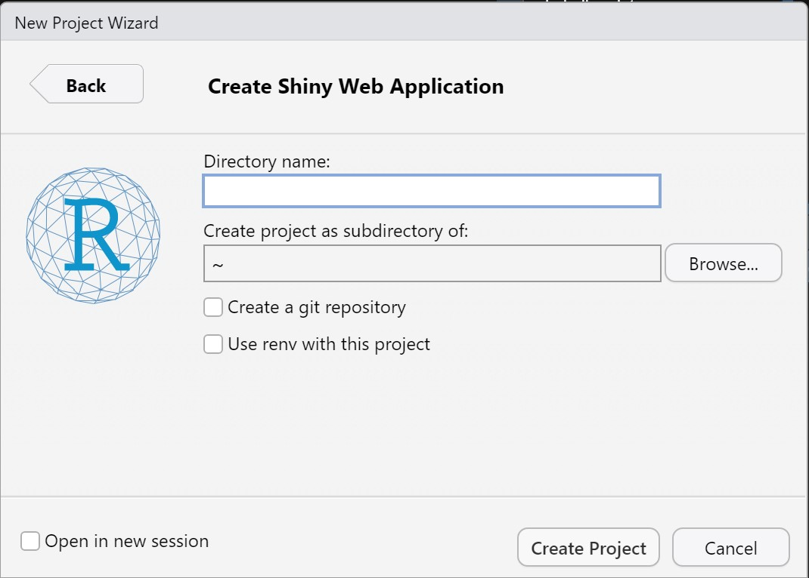
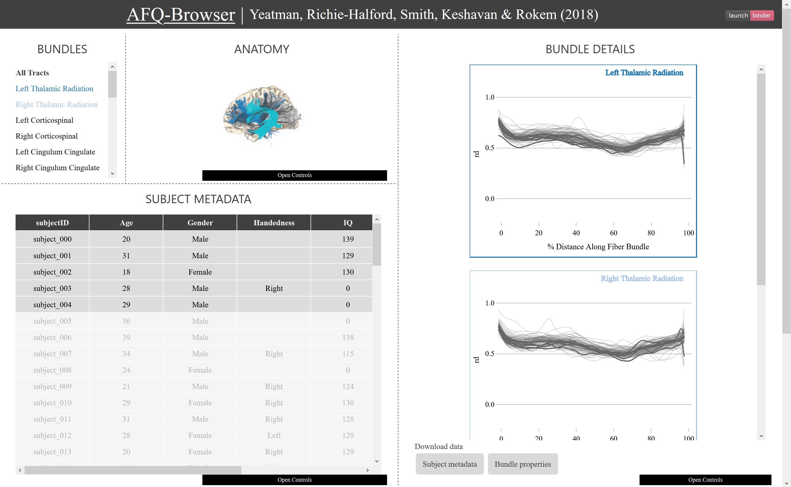
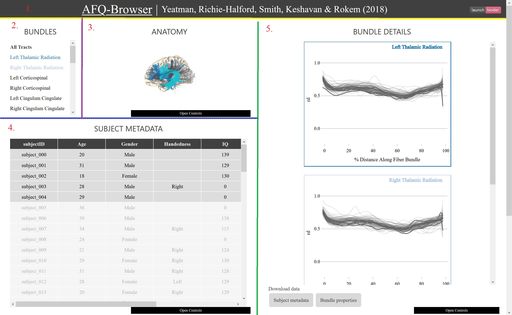

```{r setup, include=FALSE}
knitr::opts_chunk$set(echo = TRUE)
```

```{r message=FALSE}
library(dplyr)
```

# Introduction

R Shiny is a package that lets you build interactive web apps. There are plenty of different applications of this - you can see several on the R Shiny [gallery](https://shiny.rstudio.com/gallery/). I also use Shiny extensively in my thesis project to make my algorithm for detecting patterns in transcriptomics data available publicly. There are plenty of resources for learning Shiny available online ([this](https://shiny.rstudio.com/articles/basics.html) is a good place to start) so if you're feeling confused still, make sure to check those articles out.

## Learning Objectives

1.  Learn how to create basic web apps in R Shiny
2.  Get familiar with how reactive values work

# Setting up

Shiny is installed, as per usual, from CRAN.

```{r eval=FALSE}
install.packages('shiny')
```

```{r message=FALSE}
library(shiny)
```

RStudio actually has hooks for creating Shiny Web Apps (through `File > New Project…`

{width="351"}

This makes a new project for us with a minimal R Shiny skeleton already created for us. We'll go ahead and create one of these to see what a Shiny App looks like,

**Your task:** Create a Shiny Web Application through the New Project wizard. Click the "Open in new session" checkbox to make sure it opens in a separate RStudio window. Once completed, open the `app.R` file.

You'll notice that the web app that's created for us uses the {shiny} library, defines a UI and a server (we'll discuss this in the next section) and then makes a call to `shinyApp` to actually start the web app. You'll also notice that the `Run` button in the top-right corner of your source window has been changed to a `Run App` button, which is basically just a shortcut for you to do the same thing as `shinyApp` (aka., run the app). Click that run button and explore the sample app to get a sense of what we're dealing with here.

# R Shiny skeleton

Shiny apps are composed of two major components which interact extensively: a UI and a server. This is reflected inside the `app.R` file by the two variables, `ui` and `server`. We'll review each function in our sample app to learn about the different components of each.

## UI

I'll copy the UI code from the sample app for convenience and we'll digest it bit by bit.

```{r eval=FALSE}
ui <- fluidPage(

    # Application title
    titlePanel("Old Faithful Geyser Data"),

    # Sidebar with a slider input for number of bins 
    sidebarLayout(
        sidebarPanel(
            sliderInput("bins",
                        "Number of bins:",
                        min = 1,
                        max = 50,
                        value = 30)
        ),

        # Show a plot of the generated distribution
        mainPanel(
           plotOutput("distPlot")
        )
    )
)
```

The UI defines what the user sees and what interactive elements are available for them. It's basically HTML (so if you know basic HTML, you'll find this much easier) and in fact, you can `print(ui)` to see the HTML representation of your UI.

In this example specifically, we define UI to be a `fluidPage` (a responsive web page) which has a title (`titlePanel`), and a pre-styled "sidebar layout" (`sidebarLayout`, which is simply a layout for a web page that includes a side bar). The sidebar panel (`sidebarPanel`) contains one input object: a `sliderInput` which users will be able to interact with. Outside of the sidebar, in the `mainPanel`, there's an output object: `plotOutput`, which will display a plot.

You can more or less read the UI code from top-down to piece together what the layout will look like. Most of these components will be used almost always when designing pages: you'll almost always begin with a `fluidPage`, likely want a `titlePanel` and perhaps even a `sidebarLayout` (although this is the most optional component).

You'll notice that there is no real computation going on here. That job is delegated to the server. Before looking at that, though, let's digest two important features, `input`s and `output`s.

### Inputs and Outputs

Shiny has a wide range of input and output objects. All inputs take the name `*Input` and all outputs `*Output` (ie. `textInput` and `numericInput` for inputs and `plotOutput` and `tableOutput` for outputs). Inputs let your users provide data to your server and outputs let you show results to them. The first argument to all inputs and outputs is an identifier, `inputId`. This is the unique name of that component that you'll refer to it as in your server code. More on this soon, but for now, just remember that it has to be unique and should describe what the input/output is.

## Server

I'll paste the server below for convenience.

```{r eval=FALSE}
server <- function(input, output) {

    output$distPlot <- renderPlot({
        # generate bins based on input$bins from ui.R
        x    <- faithful[, 2]
        bins <- seq(min(x), max(x), length.out = input$bins + 1)

        # draw the histogram with the specified number of bins
        hist(x, breaks = bins, col = 'darkgray', border = 'white')
    })
}
```

Unlike the UI, the server is a function instead of a static variable. However, unlike most functions which "return" the result of a calculation, the server function does calculations on the `input` and sends them to the `output`.

It's important to think about how this interacts with your user. When a user tries to connect to your web app, they immediately get provided with a copy of the UI. This "default" UI does not change, even if the specific user's UI updates. Instead, their copy of the UI gets populated via their own call to the `server` function. So things you write inside the server function are not shared between users and are calculated every time on page load. This means that if you have a dataset that you want to be available globally (ie. to all users), you should define it **outside** of the server function to ensure it gets shared properly.

Instead of the server function, we can do any calculations we want, and results are sent to our users by calls to a `render` function.

### Rendering outputs

Think back to our UI for a second, where we defined outputs (in this example, a `plotOutput`). We bound it to a identifier (`distPlot`). The effect of this is that in our server, we have access to an output object called `distPlot` and we can access it by extracting it by ID from our outputs (simply as `output$distPlot`, or `output$<IDENTIFIER>$` in general).

In most cases, we don't just want to access the output, but actually show something on it, which we do via. `render` functions. Code inside these render functions is "reactive", which means that it will update and re-run whenever a value it depends on becomes updated. The return value of our expression inside of render functions should be the appropriate type that we're rendering (ie. for a `renderPlot`, we should make sure we return a plot of some sort).

Shiny does some fancy things with reactive values (that I don't fully understand) to ensure that user input gets propagated to your server logic on a need-to-know basis. If we again refer to the sample server function, we can look specifically at the plot output:

```{r eval=FALSE}
output$distPlot <- renderPlot({
    # generate bins based on input$bins from ui.R
    x    <- faithful[, 2]
    bins <- seq(min(x), max(x), length.out = input$bins + 1)

    # draw the histogram with the specified number of bins
    hist(x, breaks = bins, col = 'darkgray', border = 'white')
})
```

Inside our call to `renderPlot`, we draw a histogram using base R's `hist` command. However, this histogram has `bins` defined by the user's input from the `sliderInput` called `bins`. For reference, this was defined above (copied here).

```{r eval=FALSE}
sliderInput("bins",
            "Number of bins:",
            min = 1,
            max = 50,
            value = 30)
```

Shiny detects this dependence on `bins` and ensures that whenever it gets updated, the plot is re-drawn by calling this `renderPlot` again.

## Summary of inputs and outputs

### Inputs

All inputs are of the form `*Input`. The most common ones are `sliderInput`, `numericInput`, `textInput`, `selectInput` and `checkboxInput`.

### Outputs and Render functions

All outputs are of the form `*Output` (for defining it in the UI) and have a corresponding `render*` function (for drawing it in the server). The most common ones are `plotOutput/renderPlot` `tableOutput/renderTable` and `imageOutput/renderImage`.

# A better skeleton

Although the default Shiny app creates one `app.R` file, it's possible (and I encourage you) to write your app in two files. As we discussed above, the UI and server are two distinct things and even though they interact extensively, you should be able to mentally separate their functions. It helps even more to physically separate them so that you can keep your app organized, and you can do this by creating a two-file Shiny app.

Two-file Shiny apps have a `ui.R` file and a `server.R` file in the same directory, so instead of having your project look like this:

```{r eval=FALSE}
~/app_name
|-- app.R
```

You instead have a project that looks like this:

```{r eval=FALSE}
~/app_name
|-- server.R
|-- ui.R
```

You then separate your UI and server definitions into their respective files and the result is a much tidier and easier to handle project.

# Writing web apps

The first step in writing a web app is, of course, having an idea of what you want it to look and feel like. For this workshop, we'll use [AFQ-Browser](https://www.nature.com/articles/s41467-018-03297-7) from the Yeatman Lab as an example and build our own prototype.

[{width="610"}](https://yeatmanlab.github.io/AFQBrowser-demo/)

## Laying out the UI

The first step when building our app is to build the UI. During this step, we need to consider the interactions our users will be able to have with our app and insert control elements to support these.

In HTML, which Shiny essentially compiles our R code into, things are laid out more-or-less as blocks in a grid system (these correspond to rows and columns as `fluidRow` and `column`). We can see those divisions forming roughly divided by the dashed lines.



The basic recipe for creating our page is to:

1.  Create a `fluidPage` to hold everything
2.  Building from top-to-bottom and left-to-right, create a `fluidRow` for each row, and a `column` for each column
3.  Keep subdividing those rows and columns as needed to get the rough layout.

From the above, you can see that we start with:

1.  A `fluidPage`

2.  A `fluidRow` for the header (above the yellow line)

3.  A `column` for content to the left of the green line

    1.  A `fluidRow` for the content above the blue line

        1.  Two `column`s for content in the left and right of the purple line

    2.  A `fluidRow` for the content below the blue line

4.  A `column` for content to the right of the green line

We need to explicitly set column widths, which are numbers from 1-12. For example, columns with full width (ie. that span the entire width of their parent) should have width `12`, those with half width should have width `6`, and etc.

**Your task:** Complete the start of the UI definition by filling in the different `fluidRow`s and `column`s.

```{r eval=FALSE}
ui <- fluidPage(
  # TODO Your code here
)
```

::: {.spoiler}
```{r eval=FALSE}
ui <- fluidPage(
  # The header
  fluidRow(
    ...
  ),
  
  # The content on the left side of the screen
  column(6,
    # The content above the blue line
    fluidRow(
      # The content on the left of the purple line
      column(6,
        ...
      ),
      
      # And on the right
      column(6,
        ...
      )
    ),
    
    # And below the blue line
    fluidRow(
      ...
    )
  ),
  
  # And on the right side
  column(6,
    ...
  )
)
```
:::

It's important to spend time thinking about this layout because it's very hard to change afterwards, and it is crucial in defining what kinds of elements will fit into your page.

## Adding content

With the UI shaped, we can start inserting content. Our app has quite a complex series of inputs and outputs, but we can break them down into their classes.


1.  Some **static text**, including a link. Also, an **action button** floating in the far right.
2.  A **multi-select input**
3.  A relatively complex **interactive picture**
4.  A **table**
5.  A collection of **plots**, and some **action buttons**

Some options for content we can use include:

+-----------------------+-----------------------------------------------------------------------------------------+
| Use                   | Function(s)                                                                             |
+=======================+=========================================================================================+
| Displaying text       | `h1`, `h2`, etc., `p`                                                                   |
+-----------------------+-----------------------------------------------------------------------------------------+
| Displaying links      | `a`                                                                                     |
+-----------------------+-----------------------------------------------------------------------------------------+
| Buttons               | `actionButton`, `downloadButton`                                                        |
+-----------------------+-----------------------------------------------------------------------------------------+
| Item select inputs    | `selectInput`                                                                           |
+-----------------------+-----------------------------------------------------------------------------------------+
| Tables                | `dataTableOutput`                                                                       |
+-----------------------+-----------------------------------------------------------------------------------------+
| Plots                 | `plotOutput`                                                                            |
+-----------------------+-----------------------------------------------------------------------------------------+
| Images                | `imageOutput`                                                                           |
+-----------------------+-----------------------------------------------------------------------------------------+
| More complex elements | Usually depend on another package, or can display HTML using `uiOutput` or `htmlOutput` |
+-----------------------+-----------------------------------------------------------------------------------------+

Experiment with these elements to build up the UI even further.

**Your task:** Insert some of the above elements to your existing UI code to attempt to recreate the AFQ-Browser screenshot above.

```{r}
# TODO Your code here
```

::: {.spoiler}
```{r eval=FALSE}
ui <- fluidPage(
  # The header
  fluidRow(
    a('AFQ-Browser'),
    p(' | Yeatman, Richie-Halford, Smith, Keshavan & Rokem (2018)'),
    actionButton('launch_binder', 'launch binder')
  ),
  
  # The content on the left side of the screen
  column(6,
    # The content above the blue line
    fluidRow(
      # The content on the left of the purple line
      column(6,
        selectInput('bundles', 'BUNDLES',
                    c('All Tracts',
                      'Left Thalamic Radiation',
                      'Right Thalamic Radiation',
                      'Left Corticospinal',
                      'Right Corticospinal',
                      'Left Cingulum Cingulate',
                      'Right Cingulum Cingulate',
                      'Left Cingulum',
                      'Hippocampus'),
                    multiple = T)
      ),
      
      # And on the right
      column(6,
        # We would need to install a special package to handle things like these. We'll just make it an image for now.
        uiOutput('anatomy')
      )
    ),
    
    # And below the blue line
    fluidRow(
      dataTableOutput('subject_metadata')
    )
  ),
  
  # And on the right side
  column(6,
    plotOutput('bundle_details'),
    downloadButton('download_metadata', 'Subject metadata'),
    downloadButton('download_bundle', 'Bundle properties')
  )
)
```
:::

### Layout tips

This process is iterative, and you should not expect to get your layout **perfect** this way. In fact, it will probably look pretty terrible at this point, and that's okay! To get things looking better, we need to add custom CSS styles to fine tune the way things display. We'll only aim to get things **roughly** in place.

We can also preview our work as we go by ensuring our `server` definition is empty and running the app.

## Writing the server

Only after you're satisfied with the UI should you begin to touch the server definition. Unlike the UI and most code you write it R, you're not beholden to any particular way of defining it. It doesn't have to be written using inputs from top-to-bottom or anything. You should organize it whatever way makes sense to you, and comment liberally.

As we saw in our skeleton example, our server reports information back to our UI by assigning to its outputs (ie. `output$distPlot <- renderPlot(…)`). In our app, we have three outputs:

1.  The image of the brain under "Anatomy", which is in truth a placeholder for some more complex display
2.  The plot output under "Bundle Details"
3.  The table output under "Subject Metadata"

**Your task:** Write a "dummy" server, which displays some sample data in our app. Make them reactive by referencing the inputs which they depend on and add `print` statements to see the effect.

```{r eval=FALSE}
server <- function(input, output) {
  # TODO Your code here
}
```

::: {.spoiler}
```{r eval=FALSE}
server <- function(input, output) {
  output$anatomy <- renderUI({
    # This should update depending on the selected bundles, so make sure to reference that input.
    print(input$bundles)
    
    img(src = 'https://www.purposegames.com/images/games/background/408/408364.png',
        width = '100%')
  })
  
  output$subject_metadata <- renderDataTable({
    data.frame(subjectID = paste0('subject_00', 0:9),
               Age = c(20, 31, 18, 28, 29),
               Gender = c('Male', 'Male', 'Female', 'Male', 'Male'),
               Handedness = c(NA, NA, NA, 'Right', NA),
               IQ = c(139, 129, 130, 0, 0))
  })
  
  output$bundle_details <- renderPlot({
    # This will update depending on the selected bundles
    print(input$bundles)
    
    data.frame(distance = 0:100,
               rd = rnorm(100, 0.5, 0.05)) %>%
      ggplot(aes(distance, rd)) +
      geom_line() +
      labs(x = '% Distance Along Fiber Bundle') +
      theme_bw()
  })
}
```
:::

Of course, the server will have additional complexities baked into it for displaying real data, but we won't trouble ourselves with the gory details right now.

## Finishing touches

Once the UI and server are mostly complete, we can tackle some of the finer layout details (think font sizes, background colors, margins and etc.). These are mostly done through CSS. You do not need to be an expert on all things web development, but these things are good to be aware of.

The easiest way to get started with custom CSS is by creating a `www` folder inside your Shiny app. This will include any additional web files (images, CSS, JavaScript, etc.) to include in your web app. I recommend the following structure to keep yourself super organized by separating CSS, JavaScript and images.

```{r eval=FALSE}
~/app_name
|-- server.R
|-- ui.R
|-- www
|---- css
|---- js
|---- img
```

To the CSS directory, we can then add our custom CSS styles (which are files ending in `.css`) and embed them in our app using the `includeCSS` function.

Again, we won't go through an entire example of this because it gets pretty deep into the "advanced" side of Shiny, but for those who do plan to pursue this...

You may have a style sheet called `style.css` that you intend to use in your web app.

```{r eval=FALSE}
~/app_name
|-- server.R
|-- ui.R
|-- www
|---- css
|------ style.css
```

We can use it by modifying our `ui`, adding a single line:

```{r eval=FALSE}
ui <- fluidPage(
  # Add this call to the top of your page with the path to your file
  includeCSS('www/css/style.css')
  
  # And the rest of your UI is as normal
  ...
)
```
